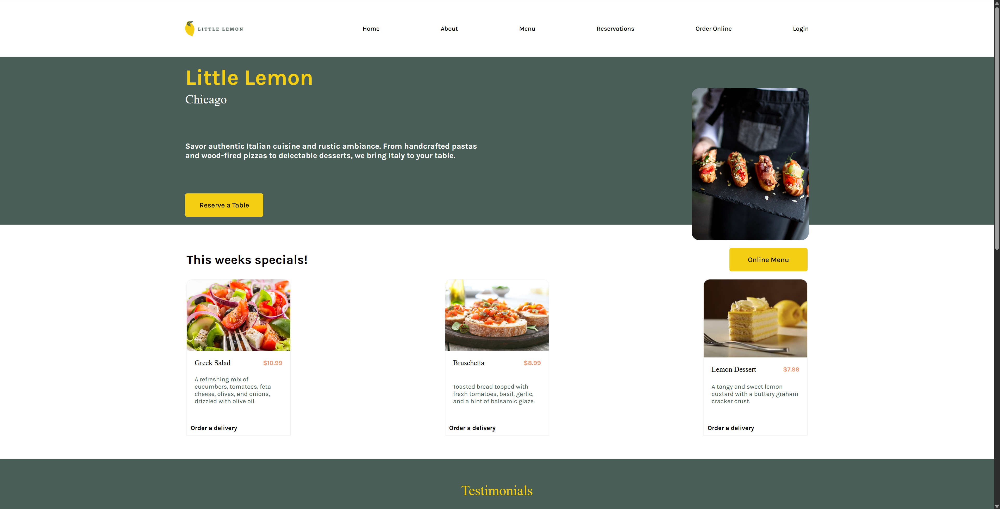
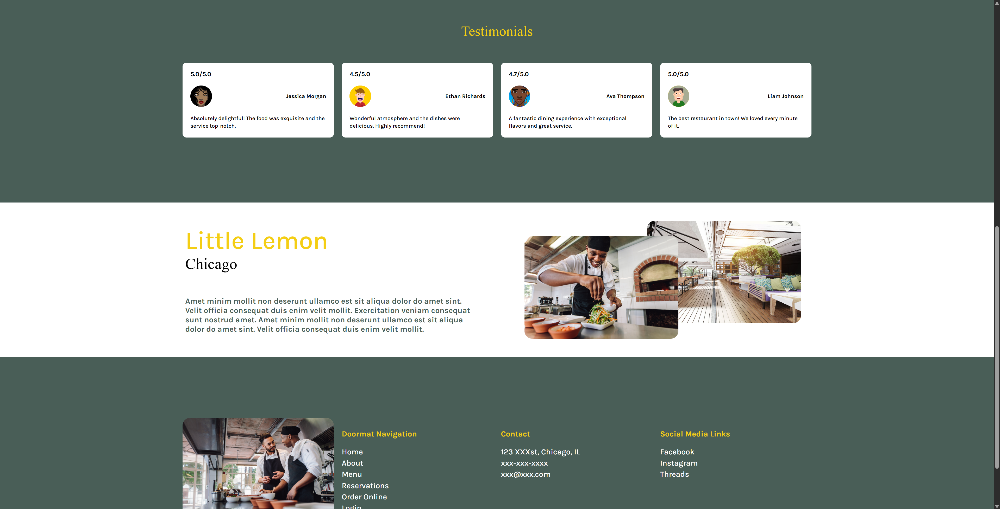
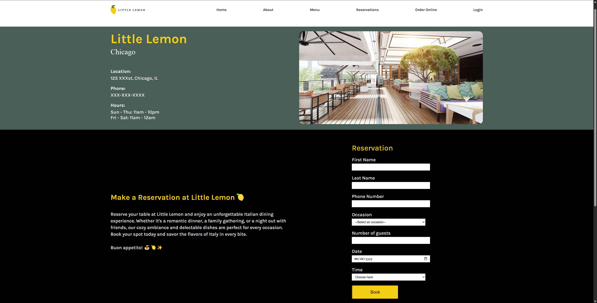
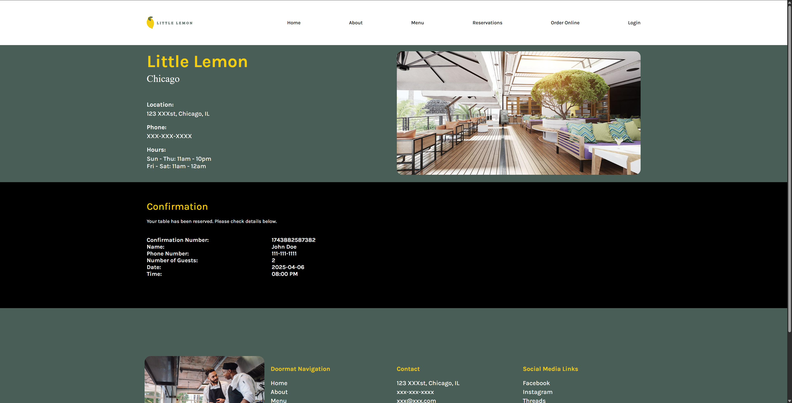

# Little Lemon Restaurant 🍋

This project was built as part of the Meta Frontend Developer Specialization course. The app showcases a variety of frontend technologies, including JavaScript, React, Bootstrap, and more, with an emphasis on clean and responsive design.

The Little Lemon Restaurant is a fictional restaurant that provides an interactive experience, allowing users to explore the menu, make reservations, and view their order details.

## Usage 🚀

Once the app is up and running, you can explore the following features:

- **Menu**: Browse through different categories of food items (appetizers, mains, desserts, drinks).
- **Reservations**: Book a table for dining by filling out the reservation form.
- **Reservation Summary**: Review your reservation.
- **Responsive Design**: The app is fully responsive and works across various devices.

## Features 🔧

- **Interactive Menu**: The app displays a dynamic menu where users can view various food categories with descriptions and prices.
- **Reservation System**: Users can make reservations by choosing the date, time, and number of guests.
- **React Router**: Smooth navigation between different pages (Home, Menu, Reservations, etc.).
- **API Calls**: Fetching data such as menu items and reservation details through API calls.
- **React Context**: Centralized state management across different components for managing reservation data.
- **Hooks**: Leveraging React hooks like `useState` and `useEffect` for managing local state and side effects.
- **Bootstrap**: Styling the app with Bootstrap to ensure it’s mobile-friendly and has a clean layout.

## Technologies Used ⚙️

This project utilizes the following technologies:

- **JavaScript**: Core scripting language used for the app's logic and functionality.
- **React**: The main library used for building the user interface and handling the app's state and routing.
- **React Router**: For seamless navigation between pages without reloading the browser.
- **Bootstrap**: For responsive and mobile-first UI components.
- **API Calls**: Fetching data from external APIs (for menu items, reservations, etc.).
- **React Context**: Managing global state (like reservation details) across the app.
- **React Hooks**: Using hooks such as `useState`, `useEffect`, and custom hooks for managing state and side effects.
- **HTML & CSS**: Structuring and styling the application, following best practices for semantic HTML and modern CSS.
- **Version Control (Git)**: Version control used for managing the codebase and collaborating effectively.

## Demo Images 🖼️

Here are some screenshots of the app:

### Homepage - 1

### Menu Page

### Reservation Form

### Reservation Confirmation

